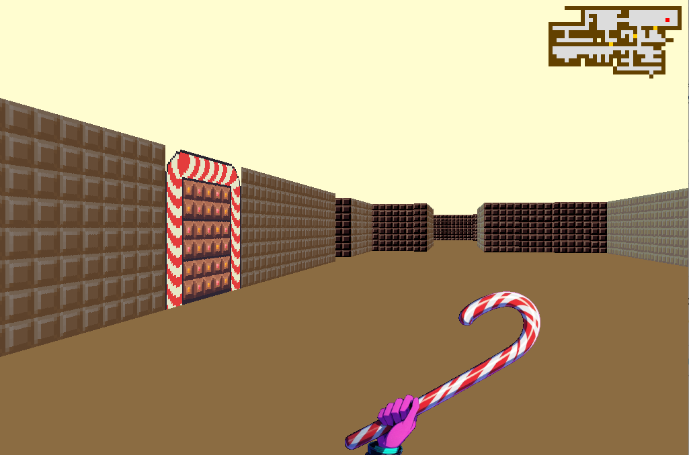

# Cub3D - 42 Project

*Un moteur 3D basé sur le raycasting, inspiré de Wolfenstein 3D*

---

## Description
**Cub3D** est un projet de graphics programming qui implémente un moteur 3D rudimentaire en C avec la **MiniLibX**. Le programme génère une vue en première personne à partir d'une carte 2D, en utilisant la technique du *raycasting*.


---

## Fonctionnalités

### Obligatoires
- **Parsing du fichier `.cub`**  
  - Textures des murs (NO/SO/EA/WE)  
  - Couleurs du sol (F) et plafond (C)  
  - Carte avec murs (`1`), espaces vides (`0`) et position de départ (N/S/E/W)  
- **Mouvement**  
  - Déplacements: `WASD`  
  - Rotation: `←` / `→`  
- **Collisions** avec les murs  
- **Gestion d'erreurs** robuste (carte non fermée, textures manquantes, etc.)  

### Bonus (implémentés)  
- **🎯 Minimap 2D**
- **🎯 Textures animées** (main du player)  
- **🎯 Interactions** (ouvrir/fermer les portes avec `espace`)  
- **🎯 Visée à la souris**

---

## 🛠 Installation & Usage

```bash
git clone https://github.com/allemago/cub3D.git
cd cub3D
make bonus && ./cub3D maps/OK/map_ok1_bonus.cub
